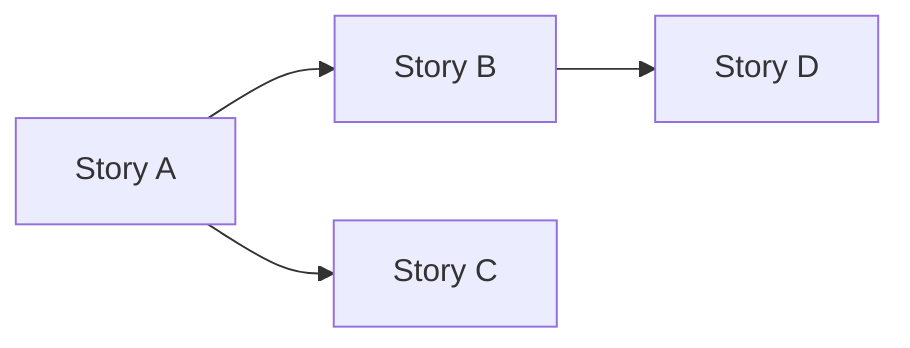

# Story Craft

Reference techniques for writing stories that engineers can act on without guessing, and splitting stories that are too large to be safely delivered.

______________________________________________________________________

## Example Mapping

**Origin:** Matt Wynne, Cucumber Ltd.

Use four categories to explore a story before writing acceptance criteria:

| Category  | Represents                               |
| --------- | ---------------------------------------- |
| Story     | The story being explored                 |
| Rules     | Business rules that govern the story     |
| Examples  | Concrete cases that illustrate each rule |
| Questions | Unresolved or contested points           |

**How to apply it:**

1. State the story.
1. Identify each rule. For each rule, identify concrete examples — at least one per rule.
1. Anything unknown or contested is a Question. Do not resolve it now — capture it.

**What to look for:**

- **Rules with no examples** — unverifiable assumptions.
- **Examples with no rule** — either a missing rule or a misunderstood story.
- **Contested examples** — disagreement about the expected outcome → the requirement is ambiguous.
- **>3 questions** — the story is not ready to implement.
- **Example explosion** — >5 examples for one rule → the story may be two stories.

**Key questions:**

- "What is the simplest happy-path example?"
- "What happens when [boundary condition]?"
- "Is there a case where this rule doesn't apply?"
- "What should NOT happen here that a user might expect?"

______________________________________________________________________

## INVEST Criteria — scoring rubric

**Origin:** Bill Wake, *INVEST in Good Stories and SMART Tasks* (2003).

Score each story 0–2 per letter. Stories below 8/12 are rework candidates before handoff.

| Letter          | 0                                | 1                     | 2                         |
| --------------- | -------------------------------- | --------------------- | ------------------------- |
| **I**ndependent | Hard dependency on another story | Soft dependency       | Truly independent         |
| **N**egotiable  | Implementation locked in         | Some flexibility      | Fully negotiable          |
| **V**aluable    | Internal-only, no user impact    | Indirect user value   | Direct user value         |
| **E**stimable   | No idea of effort                | Rough idea            | Clear                     |
| **S**mall       | > 1 week                         | 2–5 days              | 1–2 days                  |
| **T**estable    | No acceptance criteria           | AC exists but unclear | AC is concrete and binary |

**When a story fails:**

- Fails **I** → find the dependency; try to programme to an interface so one story can ship first
- Fails **N** → challenge fixed implementation choices; push to non-functional requirements or a constraint
- Fails **V** → ask "who benefits from this story alone?"; if nobody, it may belong inside another story
- Fails **E** → run more Example Mapping before sizing
- Fails **S** → apply a splitting pattern below
- Fails **T** → return to Example Mapping; AC must be observable and binary

______________________________________________________________________

## Story Splitting — SPIDR patterns

When a story is too large (fails INVEST **S**), apply one of:

| Pattern                         | When to apply                                         | Example split                                                                 |
| ------------------------------- | ----------------------------------------------------- | ----------------------------------------------------------------------------- |
| **Spike**                       | Unknown technology or approach                        | "Research which payment gateway to use" before "Implement payment via Stripe" |
| **Paths**                       | Multiple user journeys through the same feature       | "Log in successfully" / "Reset forgotten password"                            |
| **Interfaces**                  | Different input/output channels                       | "Import via CSV" / "Import via API"                                           |
| **Data**                        | Different data shapes or complexity                   | "Single currency" / "Multi-currency"                                          |
| **Rules**                       | Multiple business rules, each independently shippable | "Apply standard discount" / "Apply loyalty-tier discount"                     |
| **Workflow steps**              | A feature covers an end-to-end flow                   | "Enter shipping" / "Enter payment" / "Confirm order"                          |
| **Happy path then error paths** | Many error conditions                                 | Story 1: happy path; Story 2: validation errors; Story 3: system failures     |
| **Performance target**          | Correctness and performance as separate concerns      | Slice 1: correct but slow; Slice 2: meets the SLO                             |

**Rules for all splits:**

1. Every split story must independently pass INVEST.
1. Do not split horizontally (frontend as one story, backend as another) — that produces no intermediate deployable value.
1. The simplest valid slice is the walking skeleton: the thinnest path through the full stack, demonstrable end-to-end.

______________________________________________________________________

## Elephant Carpaccio

**Origin:** Alistair Cockburn.

A forcing function for finding thin vertical slices. Take one large story and slice it into the thinnest possible pieces — each deployable, each delivering some user-facing value, however small.

**How to apply it:**

1. State the large story.
1. Slice aggressively. Keep slicing until you have at least 10 stories from the original.
1. For each slice: can a user see or experience it? Can it be deployed independently? If no to either, slice further.
1. Order slices by risk and value — lead with the slice that validates the most uncertainty.

**Why it matters:** The exercise almost always reveals that the team's original "minimum" was inflated. The first deployable slice is almost always smaller — and more revealing — than anyone expected.

**Example:** "Users can check out" → entering an address → entering card details → showing an order summary → placing the order with a real payment → email confirmation → handling a declined card → handling out-of-stock during checkout → applying a discount code → ... (10+ slices, all valuable, all thin).

______________________________________________________________________

## User Story Mapping

**Origin:** Jeff Patton, *User Story Mapping* (2014).

A technique for organising stories around user journeys rather than a flat backlog. A flat backlog loses context — story maps preserve the flow.

**Structure:**

```
User activity 1 → User activity 2 → User activity 3    (backbone — user's journey)
  ↓                  ↓                  ↓
  Task A             Task C             Task E           (walking skeleton — first release)
  Task B             Task D             Task F           (enhancement stories)
                                        Task G           (later)
```

- **Backbone** (top row): the high-level steps in the user's journey, in order. This is the narrative spine.
- **Walking skeleton** (first horizontal slice): the thinnest set of stories that delivers an end-to-end journey. Deploy this first.
- **Rows below**: enhancements and alternatives, ordered by priority.

**When to use:**

- The feature spans multiple user activities or involves a multi-step journey.
- You need to identify a sensible first release slice.
- The backlog is growing but the team has lost sight of how stories connect.

**Output:** A structured map that shows the journey, not a flat list. The first horizontal cut across the map is the MVP slice.

______________________________________________________________________

## Risk, Value, Size annotation

Annotate each story for prioritisation. Use Reinertsen's *weighted shortest job first*: highest value, lowest cost-of-delay first.

| Dimension | L               | M                   | H                        |
| --------- | --------------- | ------------------- | ------------------------ |
| **Risk**  | Well-understood | Some unknowns       | High chance of surprises |
| **Value** | Nice to have    | Meaningfully useful | Core to the goal         |

| Size   | XS           | S        | M        | L                   |
| ------ | ------------ | -------- | -------- | ------------------- |
| Effort | < half a day | 1–2 days | 3–5 days | > 1 week (split it) |

______________________________________________________________________

## Story dependency mapping

Not every story is independent. Capture dependencies as a DAG so downstream planning can identify which stories unblock the most others.



Stories with no incoming edges (no dependencies) are good early candidates. Stories with many outgoing edges (they unblock many others) should be prioritised highly.

______________________________________________________________________

## Acceptance criteria patterns

Three patterns, in preference order:

### 1. Scenario-based (BDD / Gherkin)

```
Given [precondition]
When  [action — one thing]
Then  [observable outcome]
```

**Quality checklist — each criterion must be:**

- **Behavioural** — what the user observes, not what the system internally does
- **Implementation-independent** — no mention of classes, tables, services, or frameworks
- **Binary** — true or false; not "fast enough" or "reasonable"
- **Given/When/Then-friendly** — maps cleanly to an automated acceptance test

**Anti-patterns:**

| Bad                     | Why                      | Better                                              |
| ----------------------- | ------------------------ | --------------------------------------------------- |
| "API returns JSON"      | Implementation detail    | "The user receives a confirmation with order ID"    |
| "System is secure"      | Non-binary, unmeasurable | "Unauthenticated requests receive a 401 response"   |
| "Uses OAuth"            | Implementation           | "User can log in with their Google account"         |
| "Works on all browsers" | Unbounded                | "Works in Chrome, Firefox, Safari (current stable)" |

### 2. Rule-based

For business rules that apply across many scenarios:

```
Rule: [the invariant]
Example: [case that illustrates it]
Example: [edge case that tests it]
```

### 3. Checklist

For non-functional requirements or compliance items. Each item must be independently verifiable:

```
- [ ] Page loads in < 1.5 s on a 4G connection (Lighthouse lab metric)
- [ ] WCAG 2.1 Level AA: no automated violations (axe-core)
```

______________________________________________________________________

## Common traps

| Trap                        | Signal                                               | Fix                                                                       |
| --------------------------- | ---------------------------------------------------- | ------------------------------------------------------------------------- |
| **Premature design**        | Requirement specifies implementation ("use a modal") | Separate what from how                                                    |
| **Missing unhappy paths**   | AC only covers success                               | For every When, ask "what if that fails?"                                 |
| **Non-functional omission** | No performance, security, or accessibility baseline  | Run the NFR catalogue in `/problem-analysis`                              |
| **Scope drift**             | Story grows with every question                      | Write down the scope statement; challenge every addition against the goal |
| **Accepted vagueness**      | Moving on despite an unresolved ambiguity            | Unresolved ambiguity now is a bug later — stay with the question          |
| **Gold-plating**            | Writer adds features the user didn't ask for         | Ask: does the user's goal require this?                                   |
